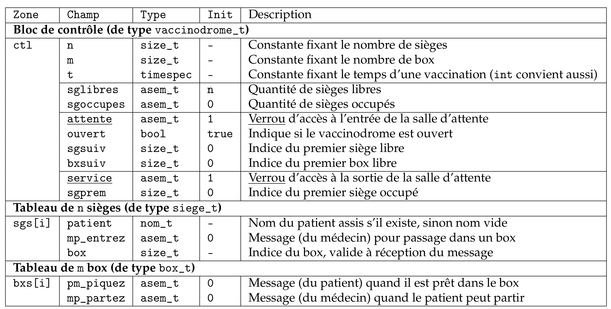
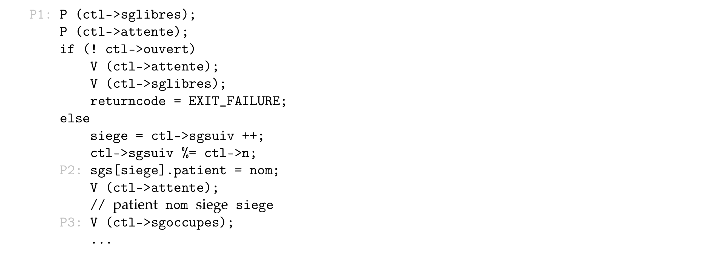
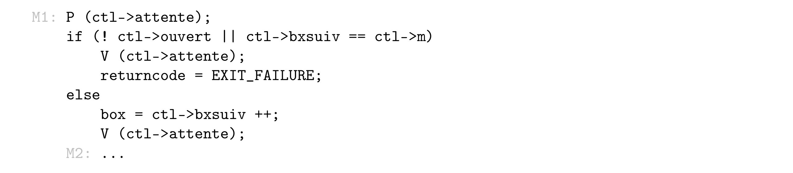
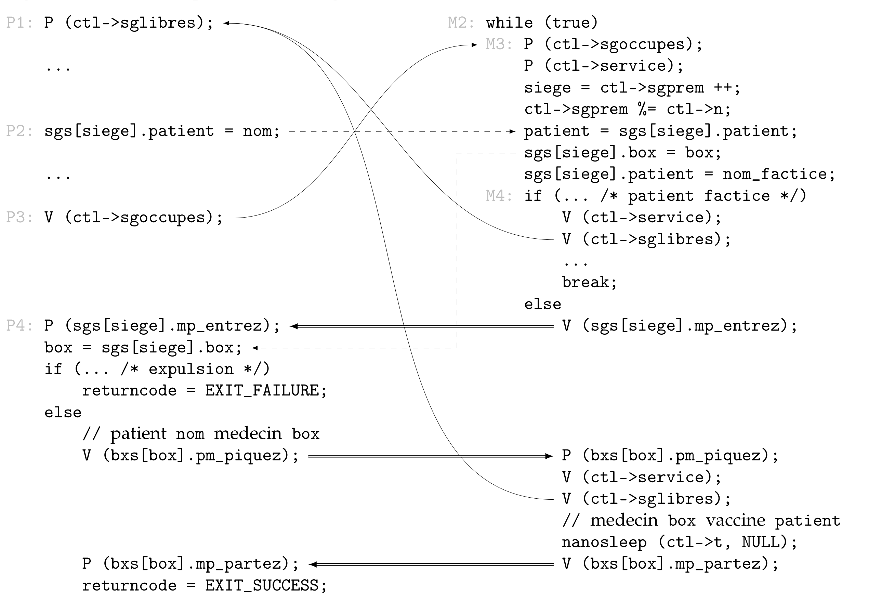
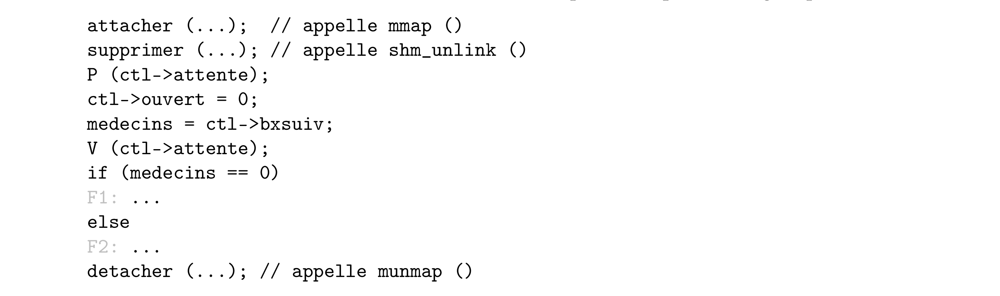
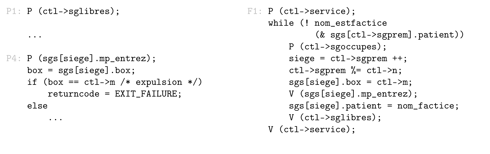
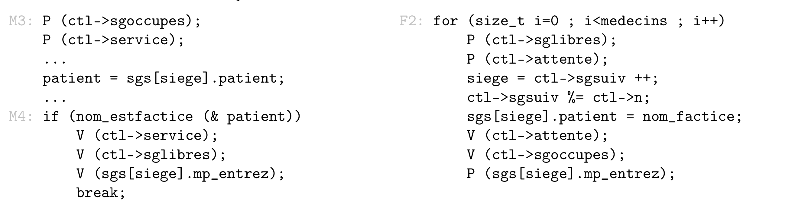

<h3 align="center">
    <a href=""></a>
</h3>

# C-Vaccinodrome
Implementation en C d'une modélisation d'un vaccinodrome composé d’une salle d’attente contenant n sièges pour les patients et d’un service de vaccination comportant m box occupés éventuellement par des médecins.

Note : ce rapport est très détaillé et essaie d’être aussi précis que possible. Il va sur certains points au-delà
de ce qui était attendu. Les parties essentielles sont la section 2.1 sur la mémoire partagée, la section 3.3 sur
l’interaction entre acteurs, et la section 3.6 pour le traitement des médecins à la fermeture.


# 1. Introduction

Le projet consiste à modéliser un vaccinodrome composé d’une salle d’attente contenant n sièges pour les patients et d’un service de vaccination comportant m box occupés éventuellement par des médecins. Les acteurs
(patients ou médecins) peuvent arriver à tout moment, et la vaccination (de durée fixée t) a lieu dès que possible. La fermeture du vaccinodrome empêche de nouvelles entrées de patients dans la salle d’attente (ou de médecin dans un box), mais les médecins présents continuent de vacciner tant que la salle n’est pas vide. Les acteurs sont tous représentés par des processus indépendants, et les seuls objets de synchronisation disponibles sont les sémaphores
Nous avons choisi de résoudre ce problème de la façon suivante :

— la salle d’attente est vue comme un tampon circulaire borné contenant des sièges 

— chaque patient est un producteur d’une seule unité dans ce tampon (lui-même assis sur un siège)

— chaque médecin consomme, de façon répétée, un patient assis dans le tampon pour le vacciner

— une vaccination est un rendez-vous entre médecin et patient, similaire à celui d’un coiffeur avec ses clients.

Notre projet suit exactement ces modèles : ce sont donc les médecins qui choisissent les patients. La fermeture du vaccinodrome utilise un mécanisme de patients factices (et dans certaines conditions de médecins factices) pour terminer proprement.


# 2. Structure de données
## 2.1 Structures de données partagées

Le tableau suivant décrit tous les éléments présents dans une mémoire partagée par tous les processus. Les trois
zones du segment de mémoire partagée (le bloc de contrôle ```ctl``` et les deux tableaux ```sgs``` et ```bxs```) sont stockées consécutivement dans la mémoire [1].



On utilise les types standard size_t pour toutes les positions et tailles, et struct timespec pour la durée. Le
type nom_t contient un nom de taille fixée (10 caractères) et permet l’affectation [4]. Le type `asem_t` est celui
fourni avec le sujet, et représente un sémaphore, muni d’un nom utilisé dans les traces de programmes.

Les sémaphores utilisés sont décrits selon leur usage :

— une *quantité* est un sémaphore « classique » permettant l’attribution de ressources, et sert aux consomma-
teurs (via l’opération **P**) et aux producteurs (via **V**) : ici sglibres et sgoccupes mesurent l’occupation des
sièges de la salle d’attente, qui est un tampon borné contenant des patients ;

— un *verrou* permet l’exclusion mutuelle pour l’accès aux données associées (via **P** et **V** utilisées successivement par un processus) : ici attente protège `ouvert/sgsuiv/bxsuiv`, et service protège sgprem ;

— un *message* permet à un processus de « réveiller » (via **V**) un autre processus qui « attend » (via **P**) ; dans
notre cas les noms des messages sont préfixés par deux caractères indiquant les types des émetteur et
récepteur (`mp` : du médecin au patient, et vice-versa).
Enfin, le segment de mémoire partagée n’est pas accessible avant d’être complètement initialisé, afin de garantir
qu’aucun processus trop empressé ne puisse y trouver un état incorrect [2].

## 2.2 Structures de données non partagées
Chaque processus accède au segment de mémoire partagée via trois pointeurs initialisées au moment de l’attachement par `mmap` [3] ; leurs noms figurent dans la première colonne du tableau ci-dessus. On utilise aussi des variables locales nommées nom, patient, siege ou box pour représenter des données utilisées temporairement par un programme : leurs déclarations n’apparaissent pas dans le pseudo-code ci-après.

# 3. Synchronisations
Les sections suivantes décrivent l’action des différents acteurs (patients, médecins, et processus de fermeture),
sous la forme de pseudo-code. Nous avons conservé dans ce pseudo-code quelques idiosyncrasies du langage
C (les pointeurs, les boucles, les étiquettes) mais omis certains détails :

— chaque programme débute par l’attachement du segment de mémoire partagée (qui initialise `ctl`, `sgs` et
`bxs`), et se termine par le détachement de ce segment ;

— l’imbrication des structures de contrôle est traduite par l’indentation, et toutes les accolades sont omises ;

— les étiquettes d’instruction (« P1: » etc.) ne servent qu’à baliser les fragments de code ; en particulier, elles
sont considérées comme faisant partie de l’indentation ;

— certaines parties non pertinentes sont remplacées par ... et souvent décrites plus loin dans le rapport.
D’autre part, le mécanisme de fermeture du vaccinodrome intervient à divers endroits du code, mais sa description complète est différée à la section ***3.4***.

## 3.1 Arrivée d’un patient
Un patient entrant a besoin d’obtenir un siège libre, après quoi il peut, s’il n’est pas trop tard, occuper le siège
en y inscrivant son nom, et enfin signaler aux éventuels médecins qu’un siège supplémentaire est occupé.



Le test d’ouverture et l’obtention du siège sont effectués simultanément, en exclusion mutuelle sur l’entrée de
la salle d’attente. Les patients qui « attendent dehors » sont ceux qui sont bloqués sur le sémaphore `sglibres`.

## 3.2 Arrivée d’un médecin
Un médecin doit également accéder à l’entrée de la salle d’attente, afin de vérifier que le vaccinodrome est
ouvert et qu’il est encore possible d’obtenir un box.



Un médecin n’attend pas un box : le test de disponibilité est immédiat et définitif. Un médecin retardataire
s’arrête immédiatement. À leur arrivée, les médecins disputent aux patients l’accès à l’entrée de la salle d’attente à l’aide du verrou attente ; c’est la seule fois au cours de leur exécution qu’ils utilisent ce verrou.

## 3.3 Interactions entre patients et médecins
L’interaction entre médecin et patient est basée sur deux types de synchronisation :

— le médecin est un consommateur de patients dans le tampon formé par les sièges de la salle d’attente ;

— médecin et patient s’échangent des messages pour mener à bien la vaccination.

Le code ci-dessous est exécuté par les acteurs après qu’ils ont obtenu leur accès au vaccinodrome. On trouve un
patient à gauche, et un médecin à droite. L’espacement vertical est sans signification et ne sert qu’à mettre en
regard l’envoi et la réception d’un message.



La décoration représente le rendez-vous (flèches doubles), la synchronisation entre producteur et consommateur (flèches simples), ainsi que la communication de données via la mémoire partagée (flèches pointillées).

Pour assurer la cohérence de la salle d’attente, c’est-à-dire éviter les situations de concurrence destructrice entre médecins cherchant leurs patients simultanément, le premier échange de message (« `entrez` », « `piquez` ») fait partie intégrante de l’opération de consommation du médecin, effectuée sous la protection du verrou service.

## 3.4 Fermeture du vaccinodrome
Au moment de la fermeture, il y a éventuellement des patients assis dans la salle d’attente, et éventuellement
des patients attendant d’y trouver un siège. Il y a ensuite deux possibilités :
1. soit il y a des médecins en train de vacciner ;
2. soit aucun médecin ne s’est présenté jusqu’alors.

Le second cas n’est pas exclu par le sujet, j’ai donc choisi de le traiter.

L’opération de fermeture commence par demander la destruction, par shm_unlink(), du segment de mémoire
partagée : cette opération n’affecte pas les processus en cours d’exécution, mais empêche de nouveaux processus
d’y accéder. Il faut ensuite positionner le booléen ouvert à false, ce qui empêche de nouveaux acteurs de
prendre part à la vaccination.

Pour ce qui est des patients qui n’ont pas encore pu obtenir de siège au moment de la fermeture, la section 3.1
montre qu’il vont traverser la salle d’attente et repartir aussitôt, à condition qu’un siège soit disponible tôt ou
tard. Mais cet événement est garanti par le fait que les médecins continuent de vacciner, et que les patients ne
« produisent » plus de siège occupé : donc, dès qu’un premier siège devient disponible, tous les patients sans
siège ont la possibilité de se terminer. Si il n’y a aucun médecin, la fermeture devra s’assurer qu’un siège devient
disponible tôt ou tard. Il n’y a rien d’autre à faire, et de toute façon les possibilités d’action sont limitées (il est
toujours possible qu’un processus « lent » ait projeté le segment dans son espace d’adressage mais pas encore
demandé un siège via sglibres). Le procédure de fermeture fait son possible, mais pas plus.

Après avoir interdit l’accès au segment de mémoire partagée, la fermeture détermine la situation à laquelle elle
fait face, et conserve dans une variable le nombre de médecins présents, qui ne changera plus :



La suite de la procédure distingue les deux cas. Dans le premier elle informe les patients assis (s’il y en a) qu’ils
sont expulsés en leur proposant de passer dans un box qui n’existe pas. Dans le second elle présente des patients
factices aux médecins encore présents. Les détails sont donnés dans les deux sections suivantes.

Les deux cas ont toutefois un point commun : la procédure de fermeture doit s’assurer qu’un acteur qui est informé de la fermeture n’a plus besoin d’accéder au segment de mémoire partagée. La raison en est que les sémaphores vont être détruits juste après avec `sem_destroy()`, et tout accès ultérieur y provoquerait un comportement indéfini [5]. L’expulsion d’un patient assis ne pose pas de problème : le message qu’il reçoit est son dernier usage d’un sémaphore. Mais l’arrêt d’un médecin nécessite un acquittement de sa part.

## 3.5 Patients après fermeture
Cette section détaille ce qui se passe entre le processus de fermeture et les patients de la salle d’attente lorsqu’il
n’y a aucun médecin dans la vaccinodrome : c’est donc le cas medecin == 0 dans la section précédente.



Le code du patient (à gauche, repris de la section 3.3) précise simplement que s’il trouve un numéro de box
égal au nombre total de box **m**, cela signifie qu’il est expulsé. La suite de son exécution consiste à se détacher du
segment de mémoire partagée via munmap(), sans avoir besoin d’accéder au moindre sémaphore.

Le processus chargé de la fermeture (à droite) prend le rôle d’un médecin : puisqu’il est seul dans ce rôle il peut
conserver le verrou service sans pénaliser aucun autre acteur. Il parcourt les patients présents en consultant
les noms sur les sièges (qui sont factices pour tous les sièges inoccupés – c’est garanti par l’initialisation et par
l’action des médecins après le choix d’un patient). Pour chaque siège occupé, il « attend » (sans délai possible)
de trouver un patient assis, le « consomme » en mettant à jour la salle d’attente et en envoyant un message
d’expulsion. Il incrémente ensuite le compteur de places libres au cas où des patients attendraient pour traverser
l’entrée et repartir sans être vacciné, ce qui ne peut arriver qu’une seule fois à la première itération de la boucle.
Il répète l’opération tant qu’il trouve des patients encore assis.


## 3.6 Médecins après fermeture
Cette section détaille ce qui se passe entre le processus de fermeture et les médecins qui vaccinent encore : c’est
donc le cas else ... à la fin du pseudo-code dans la section ***3.4***.




On voit ici (à gauche) qu’un médecin qui trouve un patient factice « rend » une place libre à la salle d’attente
(les indices ont déjà été mis à jour – cf. section ***3.3***), puis il répond en envoyant un message d’acquittement
via le sémaphore mp_entrez du siège qu’il vient de consommer. Ici cet envoi de message n’est pas fait sous la
protection du verrou service, contrairement à ce qui se passe avec un patient normal : d’une part, le siège ne
sera pas réutilisé et il n’y a aucun risque de concurrence destructrice, et d’autre part ce message d’acquittement
doit être sa dernière utilisation d’un sémaphore, et ne peut donc pas être suivie d’une opération **V()** sur le verrou service. Le médecin se termine ensuite après avoir détaché le segment de mémoire partagée.

Le processus de fermeture (à droite) quant à lui attend une place libre (ce qui arrivera certainement puisqu’il reste des médecins), « produit » un patient factice, signale son existence aux médecins, et attend l’acquittement d’un médecin via le sémaphore `mp_entrez` du siège. Il répète cette opération pour chaque médecin. Le fait qu’il relâche le verrou attente entre deux créations de patients factices est délibéré, afin que les patients retardataires aient la possibilité d’entrer dans la salle d’attente pour trouver le vaccinodrome fermé.

Cette procédure d’information des médecins ne fonctionne que parce que nous utilisons un tampon borné circulaire. On a la garantie que les patients factices arrivent après tous les patients réels déjà assis, et qu’aucun patient réel ne peut plus arriver sur un siège de la salle d’attente (le vaccinodrome est fermé). Puisque les médecins traitent les patients exactement dans l’ordre d’arrivée, l’apparition d’un patient factice dans un box assure au médecin qu’il ne verra plus jamais de patient réel. Il peut donc s’arrêter.

La procédure de fermeture dans son ensemble garantit que tous les verrous sont relâchés, que tous les messages envoyés sont reçus, et que tous les compteurs retrouvent leur valeur initiale. Les indices `sgprem` et `sgsuiv` ont
également une valeur correcte ; si le segment de mémoire n’avait pas été détruit, il suffirait de redonner à `bxsuiv`
la valeur 0 pour pouvoir à nouveau ouvrir le vaccinodrome, et accueillir de nouveaux patients et médecins.

# Remarques sur l’implémentation
Je suis satisfait de pouvoir dire que le code présenté dans ce rapport est exactement le code source de mon
programme [6], auquel j’ai retiré les accolades ici. Je suis aussi satisfait d’avoir choisi le schéma de patients-producteurs et médecins-consommateurs dans un tampon borné circulaire : les patients sont traités dans leur
ordre d’arrivée, les médecins peuvent chercher un patient pendant qu’un nouveau patient s’installe dans la salle
d’attente, et il n’est jamais nécessaire de parcourir un tableau pour trouver un patient ou un médecin. Tout cela
est aussi efficace (et simple à programmer) que possible.

Je précise maintenant quelques points techniques évoqués dans le rapport sous la forme [X] :

[1] La taille totale du segment est calculée par :

```C
sizeof (vaccinodrome_t) + n * sizeof (siege_t) + m * sizeof (box_t)
```

Théoriquement, il peut y avoir des problèmes d’alignement des données si la contrainte d’une zone est
supérieure à celle de la précédente. Avant de créer le segment de mémoire partagée, le test suivant vérifie
que les accès seront correctement alignés :

```C
if (_Alignof (siege_t) > _Alignof (vaccinodrome_t) ||
_Alignof (box_t) > _Alignof (siege_t))
...
```

et provoque une erreur si ce n’est pas le cas. (Sur mon système, toutes les structures doivent être alignées
sur un multiple de 8 octets, et il n’y a donc aucun problème.)

[2] La création du segment de mémoire partagée s’effectue avec un mode égal à zéro, qui est modifié après
initialisation des sémaphores :

```C
fd = shm_open (VAX_NAME, O_CREAT|O_EXCL|O_RDWR, 0000); // + test
... // ftruncate() + mmap() + initialisation du contenu
fchmod (fd, 0600); // + test
```

Cette technique permet d’éviter les interférences avec d’autres processus pendant l’initialisation. Le mode
0600 permet également d’éviter les éventuelles interférences avec les processus de mes camarades.

[3] Les processus qui attachent le segment de mémoire partagée utilisent trois pointeurs pour accéder à son
contenu. Voici leur initialisation :

```C
void * ma = mmap (...); // + test
vaccinodrome_t * ctl = ma;
siege_t * sgs = (siege_t *)(ctl + 1);
box_t * bxs = (box_t *) (sgs + ctl->n);
```

C’est le seul endroit où l’on utilise l’arithmétique des pointeurs.

[4] Le type nom_t, la constante nom_factice et le test nom_estfactice sont définis de la façon suivante :

```C
typedef struct { char nom [MAX_NOM+1]; } nom_t;
#define nom_factice (nom_t){ .nom={ [0]=’\0’ } }
#define nom_estfactice(pn) ((pn)->nom[0] == ’\0’)
```

L’avantage d’utiliser une structure est que C en autorise l’affectation (nom1=nom2). L’inconvénient est que
la totalité du tableau est copiée, contrairement à ce que ferait la fonction `strcpy()` avec des tableaux
directement. Mais dans notre cas, la constante MAX_NOM vaut 10, une telle structure occupe donc moins de
deux mots. L’affectation de structures complètes est dans ce cas probablement plus efficace qu’une boucle
quelconque qui ne copierait que les caractères utiles.

[5] Le problème de l’accès aux sémaphores après que le processus de fermeture a appelé `sem_destroy()`
pourrait être résolu par l’utilisation de sémaphores nommés, obtenus par `sem_open()`, parce que ceux-ci
continuent d’exister tant qu’un processus les utilise, et leur destruction est prise en charge par le système
d’exploitation. En remplaçant les sémaphores asem_t par des sémaphores nommés, on pourrait imaginer
une fermeture qui s’arrête sereinement, alors même que des patients retardataires continuent d’entrer
dans la salle d’attente pour la trouver fermée puis s’arrêter, et cela potentiellement assez longtemps. De
même, l’acquittement exigé des médecins deviendrait inutile. Cette solution était impossible à mettre en
œuvre dans ce projet.

[6] Les opérations sur les sémaphores sont des macros du pré-processeur C :

```C
#define P(ps) CHECK (asem_wait (& (ps)))
#define V(ps) CHECK (asem_post (& (ps)))
```

La macro CHECK a la définition habituelle.

# Conclusion
J’ai trouvé ce projet intéressant, surtout dans la phase de compréhension du sujet et de modélisation de la solu-
tion. Son originalité s’est cependant évanouie quand j’ai compris qu’il s’agissait d’un schéma de producteurs et
consommateurs dans un tampon borné circulaire (vu dans le cours et revu dans le TP 2) couplé à un mécanisme
similaire au coiffeur (vu dans le TD 4). Il restait tout de même quelques détails à régler : le réveil d’un patient
en section critique, la fermeture. Il est d’ailleurs ironique de constater que la fermeture du vaccinodrome est
le mécanisme qui introduit le plus de complexité et le plus de code. Finalement, tous les tests s’exécutent avec
succès, avec une marge de 5 ms « dans des conditions normales de température et de pression ».